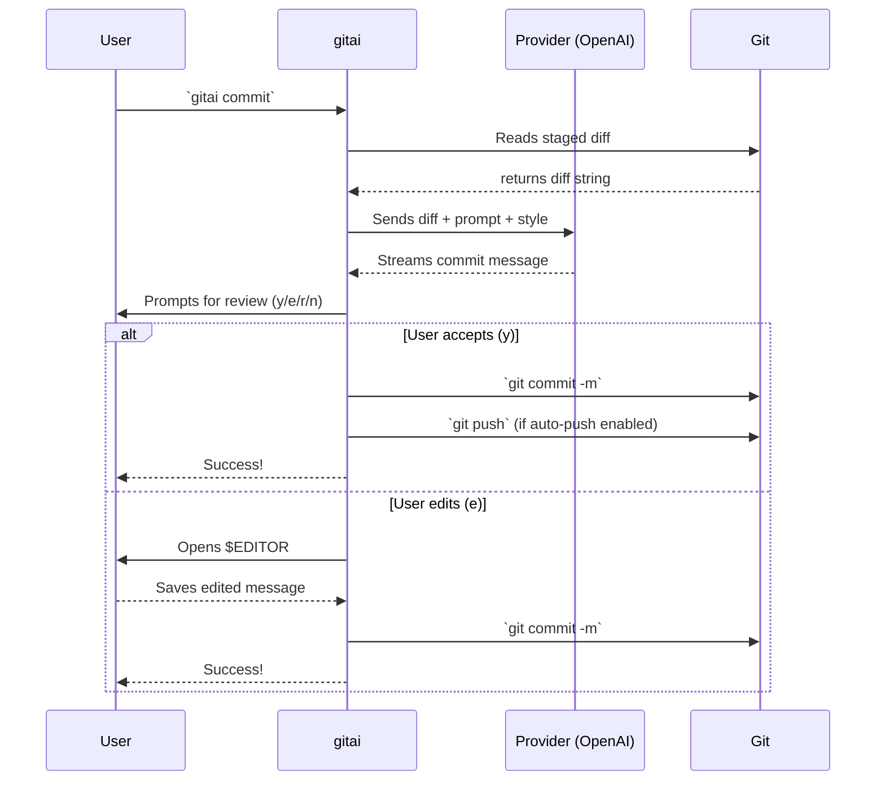

# 🤖 gitai

[](https://golang.org/doc/devel/release.html)
[](https://opensource.org/licenses/MIT)
[](https://github.com/Chifez/gitai/releases)

**AI-powered git commit CLI** — Generate meaningful commit messages using LLMs, review them interactively, then commit and push — all in one command.

---

## Table of Contents
- [Features](#-features)
- [How it Works](#-how-it-works)
- [Installation](#-installation)
- [Quick Start](#-quick-start)
- [Configuration](#%EF%B8%8F-configuration)
- [Commit Styles](#-commit-styles)
- [CLI Reference](#-cli-reference)
- [Go Library](#-go-library)
- [Contributing](#-contributing)
- [License](#-license)

---

## Features

- **Brainless Commits:** Analyzes your staged changes and writes comprehensive, accurate commit messages.
- **Interactive Review:** Accept, reject, regenerate, or manually edit the generated message inline.
- **Zero Dependencies:** Single binary. No Node.js, Python, or other runtime required.
- **All-in-One Flow:** Stage files, generate message, commit, and push in a single `gitai commit` command.
- **Interactive Picker:** Select which changed files to stage using a clean terminal UI (`--pick`).
- **Extensible:** Written in Go with public packages. Easily add new LLM providers.

---

## How it Works

The standard `gitai` flow connects the dots between writing code and shipping it.



---

## Installation

### Using Package Managers
```bash
# Homebrew (macOS/Linux)
brew install Chifez/tap/gitai

# Scoop (Windows)
scoop install gitai
```

### Using Go
Requires Go 1.22+ installed on your machine.
```bash
go install github.com/Chifez/gitai@latest
```

### Manual Installation
1. Go to the [Releases](https://github.com/Chifez/gitai/releases) page.
2. Download the binary for your OS and architecture.
3. Extract and place the `gitai` binary in your `$PATH`.

---

##  Quick Start

You don't even need to run `git add` first! If you run `gitai commit` with nothing staged, it will automatically prompt you to either stage all changes or pick files interactively.

```bash
# Stage all changes and commit with an AI-generated message
gitai commit --all

# Open the interactive file picker to choose what to stage
gitai commit --pick

# Stage specific files only and commit
gitai commit src/auth.go src/middleware.go

# Standard flow: generate message for already-staged changes
git add src/
gitai commit

# Skip review, commit immediately
gitai commit --all --yes

# First push to a new remote branch
gitai commit --all --remote https://github.com/user/repo.git
```

---

## Configuration

### First-Run Setup Wizard

The first time you run `gitai`, an interactive wizard will guide you through the initial setup automatically:

```text
No config found. Running first-time setup...

Enter your OpenAI API key: sk-...
Default model [gpt-4o-mini]: (press enter)
Commit style (conventional/simple/emoji) [conventional]:
Auto-push after commit? (y/n) [y]:
Include commit body? (y/n) [y]:

Config saved to ~/.gitai/config.yaml
Continuing with your commit...
```

### Environment Variables

GitAI respects the following environment variables. They override the config file but are overridden by CLI flags.

| Variable | Description |
|---|---|
| `OPENAI_API_KEY` | OpenAI API key (always checked first) |
| `GITAI_MODEL` | Override model |
| `GITAI_PROVIDER` | Override provider |
| `GITAI_STYLE` | Override commit style |
| `GITAI_AUTO_PUSH` | `true` or `false` |
| `GITAI_LANG` | Override message language |

### Managing Config Values

GitAI saves its core state in `~/.gitai/config.yaml`. Additional options like `include_body`, `default_remote_name`, and `auto_set_upstream` are also stored here.

Run `gitai config list` to see your current settings.
Run `gitai config help` to see all available commands.

**Setting your API Key:**
```bash
gitai config set api_key sk-... 
# Or export OPENAI_API_KEY=sk-... in your environment
```

**Customizing Behavior:**
```bash
# Change LLM Model (default is gpt-4o-mini)
gitai config set model gpt-4o

# Automatically push after committing
gitai config set auto_push true

# Change the language of the output message
gitai config set lang spanish
```

---

## Commit Styles

GitAI supports multiple commit string formats out of the box. Change it using `gitai config set style <style>` or passing `--style`.

- **`conventional`** (default): `feat(auth): add JWT refresh token rotation`
- **`simple`**: `Add JWT refresh token rotation`
- **`emoji`**: `feat(auth): add JWT refresh token rotation`

---

## CLI Reference

### `gitai commit`

| Flag | Description |
|---|---|
| `[files...]` | Files to stage before committing |
| `--pick, -p` | Interactive file picker to select changes |
| `--all, -a` | Stage all modified tracked files |
| `--include-untracked` | With `--all`, also stage untracked files |
| `--model` | LLM model for this commit |
| `--style` | Commit style: conventional, simple, emoji |
| `--context` | Natural language hint for the AI |
| `--provider` | LLM provider for this commit |
| `--lang` | Language for the message |
| `--max-length` | Max subject line characters (default: 72) |
| `--no-push` | Skip push entirely |
| `--push` | Force push even if auto_push is off |
| `--yes, -y` | Skip review, commit immediately |
| `--dry-run` | Display message only, no commit |
| `--remote <url>` | Add remote and push (useful for first push) |
| `--remote-name <n>` | Name of the remote (default: origin) |
| `--branch <n>` | Remote branch to push to (default: current branch) |
| `--force-push` | Push with `--force-with-lease` |

### `gitai config`

| Command | Description |
|---|---|
| `list` | Print all config values and sources |
| `get <key>` | Print a single config value |
| `set <key> <value>` | Update a config value |
| `reset` | Reset config to defaults |
| `path` | Print config file path |

---

## Go Library

GitAI is built to be extensible. All core packages in `pkg/` are public and can be imported into your own Go tools.

```go
import (
    "github.com/Chifez/gitai/pkg/provider"
    "github.com/Chifez/gitai/pkg/git"
    "github.com/Chifez/gitai/pkg/prompt"
)
```

---

## Contributing

We welcome community contributions! Whether it's reporting a bug, proposing a new feature, or submitting a Pull Request, your help is appreciated.

### How to Contribute

1. **Fork the Repository**: Click the 'Fork' button at the top right of this page.
2. **Clone your Fork**: 
   ```bash
   git clone https://github.com/YOUR_USERNAME/gitai.git
   cd gitai
   ```
3. **Create a Branch**: Create a feature branch for your work.
   ```bash
   git checkout -b feature/amazing-feature
   ```
4. **Make Changes**: Implement your feature or fix. Follow existing Go patterns and keep things clean!
5. **Run Tests**: Ensure all tests pass.
   ```bash
   go test ./...
   ```
6. **Commit & Push**: 
   ```bash
   gitai commit --all
   git push origin feature/amazing-feature
   ```
7. **Open a Pull Request**: Go to the original repository and click "Compare & pull request".

### Reporting Issues

If you find a bug or have a feature request, please [Open an Issue](https://github.com/Chifez/gitai/issues/new). Provide as much context as possible, including OS version, `gitai` version, and any relevant logs.

---

## License

This project is licensed under the [MIT License](LICENSE).
